# to-do-list Project
This is a simple to-do list project to explore and practice the use of Javascript and its library.
## Project Description
This project adopt a basic client/server structure over http to perform to-do list functionality. That includes checking task and removing tasks. Since the data is stored in the database in server side, data is preserved even after reloading the page.
## Functionality
### Add new tasks
1. Create new task by clicking the 'add' button
    

2. Enter the task description and click 'Create Task'
    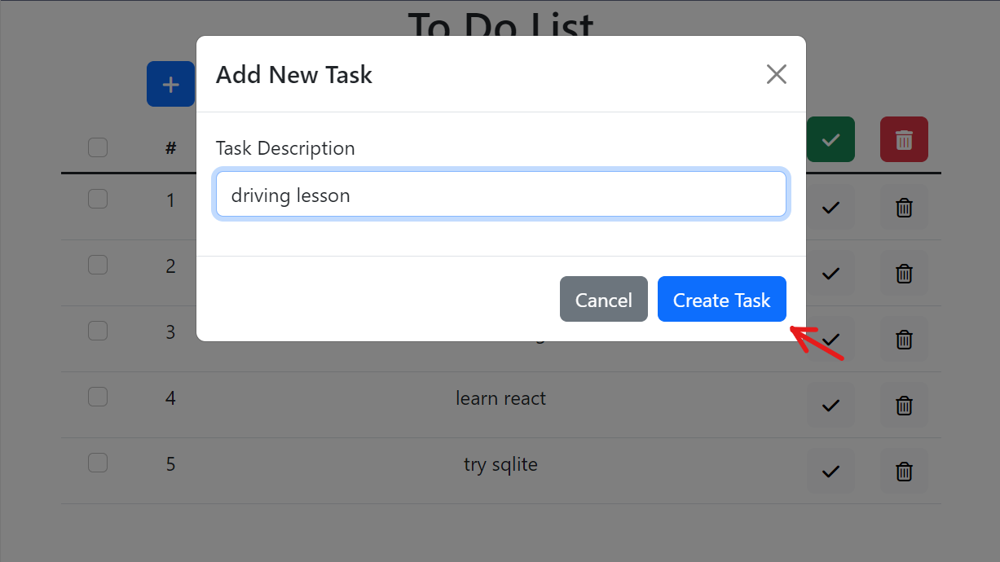

3. A new task is created
    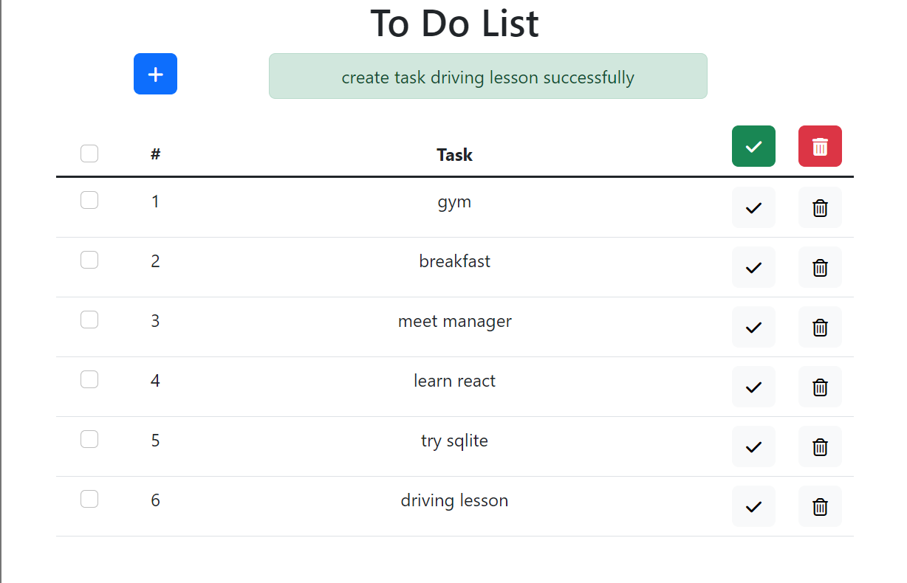
### Checking/Unchecking tasks
Tasks can be checked/unchecked by this group of 'tick' buttons
    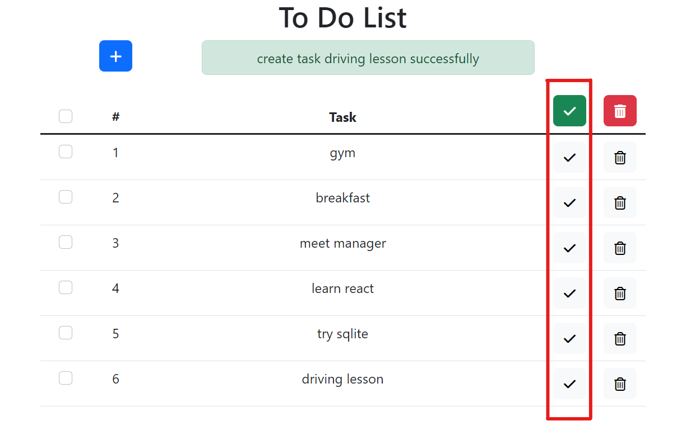
#### Check/Uncheck a task
1. Click on the check button of a specific task
    
2. The task is checked
    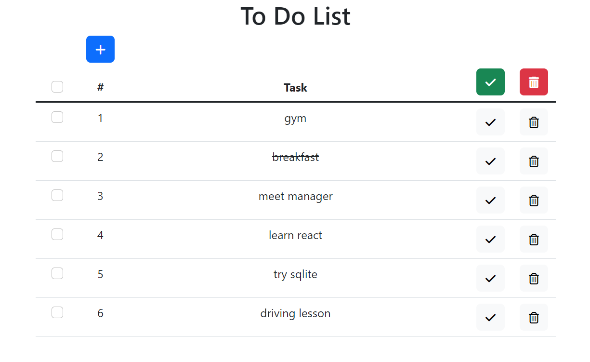
Uncheck a task can be performed in the same way.
#### Check/Uncheck a number of tasks
A number of tasks can be checked/unchecked at once by the following steps
1. Select a number of tasks with the checkboxs
    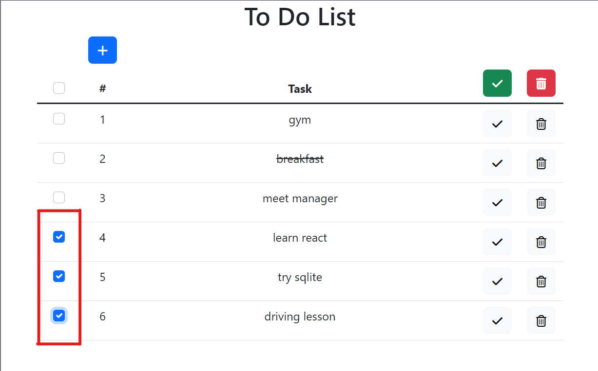
2. Click the 'check selected' button to check all selected tasks
    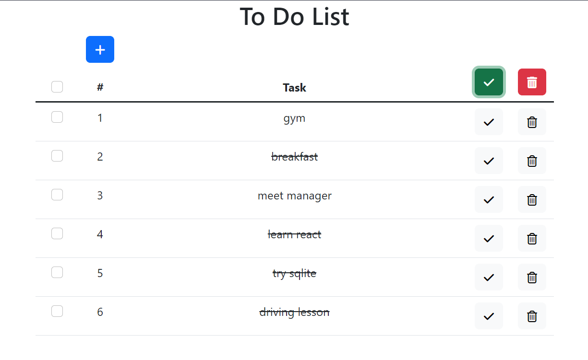
Uncheck a number of tasks can be performed in the same way.
### Removing tasks
Tasks can be removed by this group of 'remove' buttons
    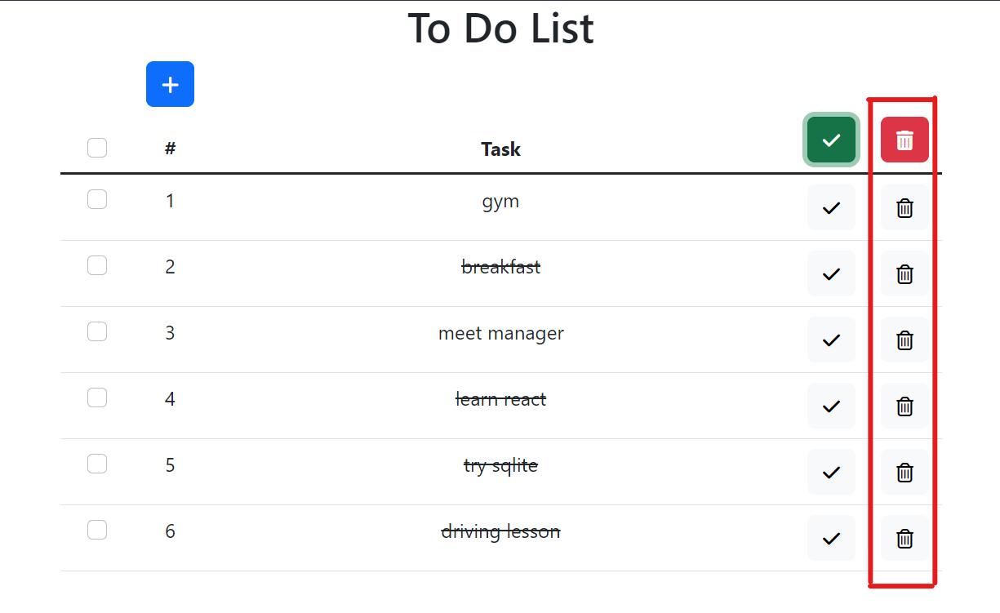
#### Remove a task
1. Remove a task by clicking the 'remove' button
    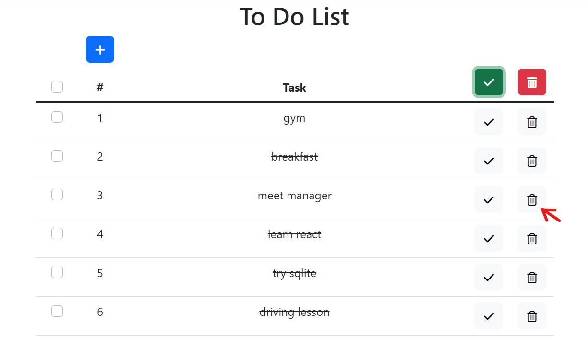
2. A task is removed
    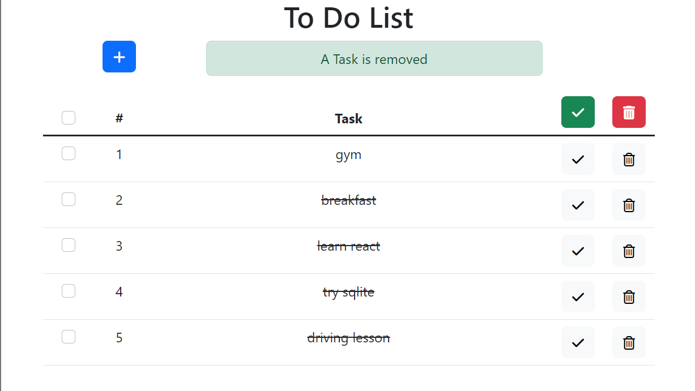

#### Remove a number of tasks
A number of tasks can be removed at once by the following steps
1. Select a number of tasks with the checkboxs
    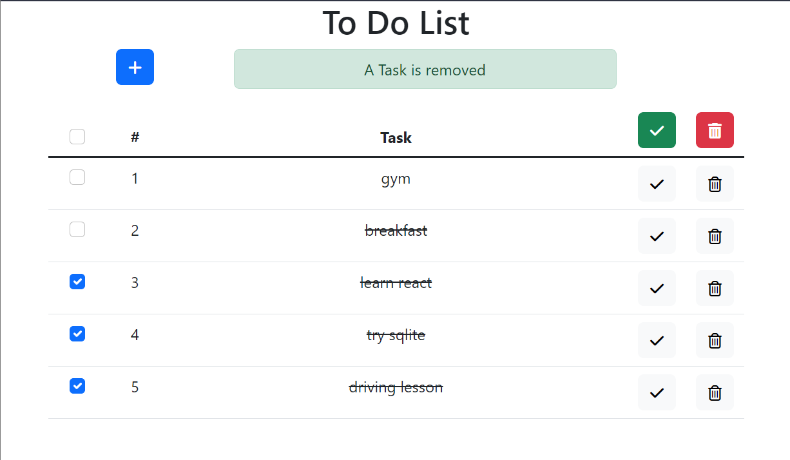
2. Click the 'remove selected' button to remove all selected tasks
    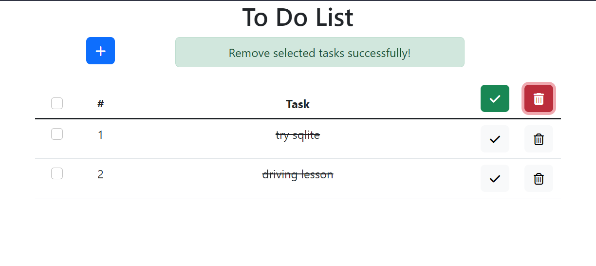
## Launching the application
### Server side
#### Start the server
> ```ps
> PS F:\GitHub\to-do-list> npm run server
> > to-do-list_nodejs@0.0.1 server
> > node ./server/server.js
>
> openConnection: open database connection
> closeConnection: close database conection
> Server: Server is running on http://127.0.0.1:3000
> Database initialized successfully.

#### Access the application

